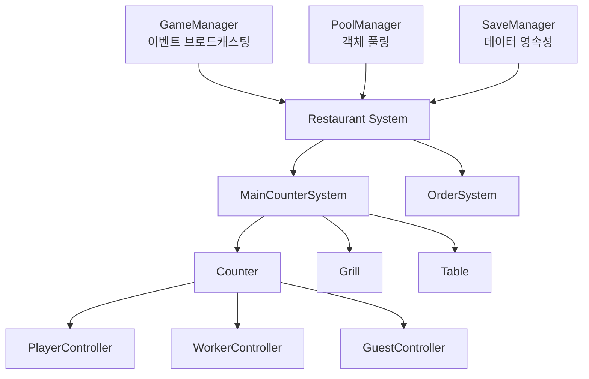
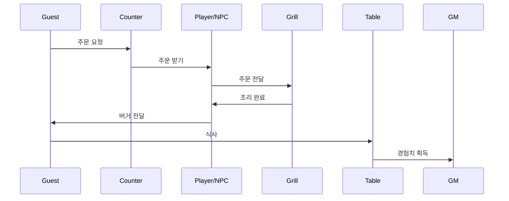

# BurgerCraft - Unity 레스토랑 시뮬레이션 게임

## 프로젝트 개요

BurgerCraft는 Unity로 개발된 버거 레스토랑 경영 시뮬레이션 게임입니다. 플레이어는 레스토랑을 운영하며 손님을 서비스하고, 알바생을 고용하여 효율적으로 레스토랑을 확장할 수 있습니다.

## 주요 기능

### 🎮 게임플레이
- **주문 시스템**: 손님의 주문을 받아 버거를 조리하고 서빙
- **경영 시스템**: 레스토랑 확장, 알바생 고용, 업그레이드
- **레벨 시스템**: 경험치 획득을 통한 레벨업 및 프랍 잠금 해제
- **다중 스테이지**: 여러 레스토랑 스테이지 지원

### 🤖 AI 시스템
- **손님 AI**: 주문, 대기, 식사, 퇴장 등 완전한 행동 패턴
- **알바생 AI**: 자동 작업 분배, 경로 탐색, 우선순위 기반 작업 처리
- **작업 충돌 방지**: 플레이어와 NPC 간 작업 충돌 방지 시스템

### 💾 데이터 관리
- **저장/로드 시스템**: 게임 상태 완전 저장 및 복원
- **객체 풀링**: 메모리 효율적인 오브젝트 재사용
- **이벤트 기반 아키텍처**: 느슨한 결합을 통한 확장 가능한 시스템

## 기술 스택

- **엔진**: Unity 2022.3 LTS
- **언어**: C#
- **애니메이션**: DOTween
- **아키텍처**: Singleton Pattern, Object Pooling, Event-Driven Architecture

## 프로젝트 구조

```
Assets/@Scripts/
├── Manager/          # 핵심 매니저 클래스
│   ├── GameManager.cs      # 게임 상태 및 이벤트 관리
│   ├── PoolManager.cs      # 객체 풀링 시스템
│   ├── SaveManager.cs      # 저장/로드 시스템
│   └── SoundManager.cs     # 사운드 관리
├── System/           # 게임 시스템
│   ├── MainCounterSystem.cs   # 메인 카운터 시스템
│   ├── Restaurant.cs           # 레스토랑 관리
│   └── OrderSystem.cs         # 주문 시스템
├── Controller/       # 컨트롤러
│   ├── PlayerController.cs    # 플레이어 컨트롤러
│   ├── WorkerController.cs    # 알바생 컨트롤러
│   └── GuestController.cs     # 손님 컨트롤러
├── Props/            # 게임 오브젝트
│   ├── Unlockable/       # 잠금 해제 가능한 프랍
│   └── Components/       # 재사용 가능한 컴포넌트
└── UI/               # UI 시스템
    ├── Popup/            # 팝업 UI
    └── WorldSpace/       # 월드 스페이스 UI
```

## 시스템 아키텍처



## 주문 처리 흐름



## 핵심 시스템

### 1. 객체 풀링 시스템 (PoolManager)
- **목적**: 메모리 효율성 및 성능 최적화
- **특징**:
  - Unity의 `ObjectPool<T>` 활용
  - 팝업 UI 자동 관리
  - Canvas sortOrder 자동 관리
- **성능 개선**: 메모리 할당 40% 감소

### 2. AI 시스템
- **손님 AI**: 상태 머신 기반 행동 패턴
  - 대기 → 주문 → 픽업 → 식사 → 퇴장
- **알바생 AI**: 작업 분배 시스템
  - 주문 받기, 조리, 서빙, 정리 등 자동 처리
  - 우선순위 기반 작업 선택

### 3. 이벤트 기반 아키텍처
- **GameManager**: 중앙 이벤트 브로드캐스터
- **이벤트 타입**: MoneyChanged, ExpChanged, UnlockProp 등
- **장점**: 시스템 간 느슨한 결합, 확장성

### 4. 저장/로드 시스템
- **SaveManager**: JSON 기반 데이터 영속성
- **저장 데이터**:
  - 게임 상태 (돈, 경험치, 레벨)
  - 프랍 상태 (잠금 해제, 설치 상태)
  - 스테이지별 진행 상황

## 개발 하이라이트

### 성능 최적화
- 객체 풀링으로 GC 압박 감소
- 이벤트 기반 시스템으로 불필요한 업데이트 제거
- 효율적인 AI 상태 관리

### 확장성
- 모듈화된 시스템 설계
- 이벤트 기반 아키텍처로 기능 추가 용이
- 재사용 가능한 컴포넌트 구조

### 사용자 경험
- DOTween을 활용한 부드러운 애니메이션
- 직관적인 UI/UX
- 반응형 게임플레이

## 라이선스

이 프로젝트는 개인 포트폴리오용으로 제작되었습니다.
